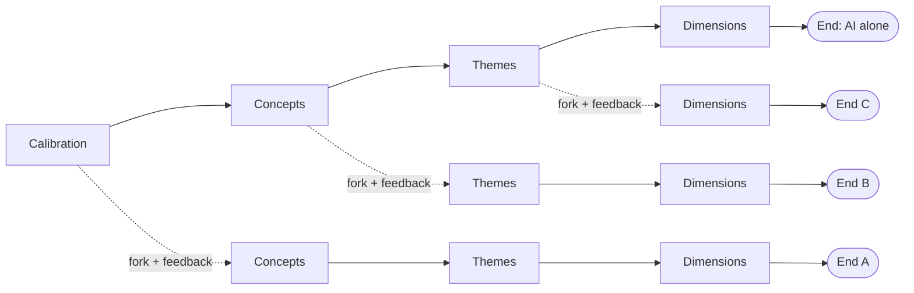

# How it works, in plain words

An AI does the Gioia analysis of the interviews. The researcher steers it. Every step is saved, so
the analysis can be rewound to any step and continued in a different direction.

## Gioia in three levels

| Level | What it is | Example |
|---|---|---|
| **Concepts** | What people actually said | "Clients now expect a new release every two weeks" |
| **Themes** | What several concepts have in common | "Customers set the pace of delivery" |
| **Dimensions** | The big answers to the research question | "Delivery is becoming continuous" |

Every dimension rests on themes, every theme on concepts, and every concept on real quotes.

## The steps

| Step | The AI does | The system checks |
|---|---|---|
| 1. **Calibration** | Codes 3 interviews, proposes rules, asks questions | Every quote is really in the interview |
| 2. **Concepts** | Codes the other interviews, one at a time | Same quote check; no jumping ahead |
| 3. **Themes** | Groups concepts into themes | A theme has 2+ concepts, each with a reason |
| 4. **Dimensions** | Groups themes, says how each answers the question | Each dimension answers the question and has been checked against counter-evidence |
| 5. **Revision** | Rechecks the whole structure | Nothing is left open |

After each step the AI stops, so the researcher can look before it goes on.

## Step 1: let the AI run to the end

First the AI does the whole analysis alone, with no feedback. This gives a complete result to look
at and a baseline to compare everything else with.

## Step 2: branch off where you disagree

Every step is saved, like save points in a game. From any of them you can start a new branch with
your correction and let the AI continue from there. The original stays as it was.

- **Fork after calibration:** see what your early guidance changes, all the way to the end.
- **Fork after concepts:** keep the coding, redo the grouping (or do the grouping yourself).
- **Fork after themes:** keep the themes, redo the dimensions.

## Step 3: compare all the ends

Put the endings side by side. Which dimensions appear in every version? Which only appear with
your guidance? What did your intervention actually change?

## Two ways to steer

1. **The plan looks wrong.** At a stop, you see the AI heading the wrong way, for example coding
   the wrong things or asking a question you can answer. You correct it before it continues.
2. **The result looks wrong.** At the end, the dimensions are not what the research needed. You go
   back to the step where it went wrong and branch off from there.

Either way, a correction can be an edit to the current version or a new branch. Nothing is lost.

## What the researcher can do at a stop

- Answer the AI's questions
- Approve, edit or reject its rules
- Rename or reject concepts, themes or dimensions
- Do a step yourself, for example the grouping
- Branch off with any of the above

## What the system never lets through

- A quote that is not word for word in the interview
- A concept without a quote, or a quote without a reason
- A theme with one concept, or a concept in two themes
- A dimension that does not answer the research question
- The AI approving its own rules, or skipping ahead a step
- Deleting anything: every change is logged, with who made it and why

## Example

17 expert interviews, AI alone, about 1.5 hours: 510 concepts, 42 themes, 6 dimensions. At
calibration the AI asked: *"Should I merge similar ideas from different people?"* Nobody answered
in the AI-only run, so it kept them all separate. That question is the first fork to try.

---

Technical details: [README](../README.md) · design: [pipeline.md](pipeline.md) · the example run:
[smoke-tests/2026-10-07-experts-ai1.md](smoke-tests/2026-10-07-experts-ai1.md)
